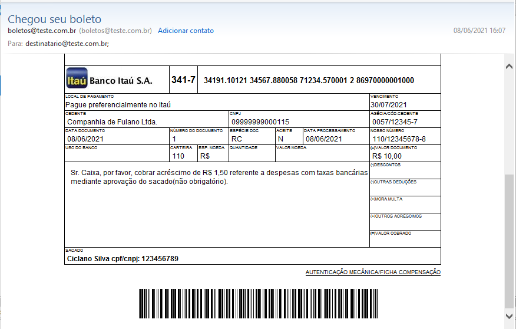

# Payment Slip Mail

## Descrição

Este repositório contém um mini-projeto para o envio de boletos bancários incluídos na mensagem de e-mail. 
O projeto foi desenvolvido em PHP.

<h2 id="indice">Índice</h2>

<a href="#DominioProblema">Domínio do problema.</a>

<a href="#OrganizacaoRepositorio">Organização do repositório</a>

<a href="#DadosGeracaoBoleto">Dados para geração do boleto</a>

<a href="#DescricaoClasses">Descrição das classes</a>

<a href="#ClassePaymentSlip">Classe PaymentSlip</a>

<a href="#ClasseItauBankPaymentSlip">Classe ItauBankPaymentSlip</a>

<a href="#ClasseMail">Classe Mail</a>

<a href="#FuncoesUtilidadesGeral">Funções de utilidade geral</a>

<a href="#ImplementacaoProjeto">Implementação do projeto</a>

<a href="#CodificacaoCaracteres">Codificação dos caracteres</a>

<a href="#Referencias">Referências e ligações externas</a>

<a href="#Anexo1">Anexo 1: Observações sobre serviço SMTP</a>

<h2 id="DominioProblema">Domínio do problema.</h2>

Os boletos são gerados com base na determinação CNAB 240 da Febraban.  
Alguns termos específicos não são de conhecimento comum aos desenvolvedores e eles estão descritos abaixo:  

Termo|Parte da nomenclatura da variável|Descrição
-----|---------------------------------|------------
Código do banco|bank_code|Código do banco 
Beneficiário ou Cedente|client_name|Instituição no qual o banco irá creditar o valor do boleto.
carteira|wallet|Modalidade de cobrança estabelecida entre banco e instituição emissor do boleto.
Código da moeda|CURRENCY_CODE|Código da moeda em uso no país. Constante de valor 9.
Pagador ou Sacado|client_lead_name|Pessoa ou instituição que irá pagar o valor do boleto.
recibo|receipt|Número de controle do beneficiário dos boletos emitidos.
Vencimento|due_date|Data de vencimento do boleto.
Código de barras|payment_code_bar|Numeração do boleto conforme à CNAB 240.
Linha digitável|bar_code_line|Representação numérica do código de barras. Não de valor igual ao código de barras. Assemelha-se com:|34191.10100 99999.888888 33333.666666 1 44440000000000
Campo livre|free_field|Parte da numeração do código de barra na qual a instituição financeira é livre para determinar como deve ser gerada.
Número do documento|document_number|Número gerado pelo beneficiário no momento da emissão do boleto.
Nosso Número||Número de controle do beneficiário conforme leiaute estabelecido pelo banco.

Como o sistema foi escrito, “codado”, tendo como base a língua inglesa, alguns termos em português brasileiro não tem tradução direta, por isso foram nomeados conforme abaixo:

* Sacado:
CPF(Cadastro de Pessoa Física)  ou CNPJ(Cadastro Nacional de Pessoa Jurídica) foi nomeado como "client lead code".

* Beneficiário:
CNPJ(Cadastro Nacional de Pessoa Jurídica) foi nomeado como "client code". 

<a href="#indice">Voltar ao índice</a>

<h2 id="OrganizacaoRepositorio">Organização do repositório</h2>

* src: Pasta com o código fonte.
* assets: Arquivos de imagem e templates usados. 
* data: Arquivos de dados usados para gerar o boleto.
* interface: Código das interfaces.
* model: Arquivos com a codificação das classes de boletos.
* services: Classes que disponibilizam serviços (Classe e-mail).
* utils: Pasta com arquivo de funções de utilidade geral.

<a href="#indice">Voltar ao índice</a>

<h2 id="DadosGeracaoBoleto">Dados para geração do boleto</h2>

Os dados para geração do boleto estão disponíveis em arquivo json com a estrutura conforme mostrado abaixo:

```json
{
    "codigoBanco": "",
    "nomeBanco": "",
    "localPagamento":"",
    "instrucoes":"",
    "beneficiario": {
        "carteira":"",
        "conta":"",
        "agencia": "",
        "cnpj":"",
        "nome":""
    },
    "pagador":{
        "nome":"",
        "cpf_cnpj":"",
        "recibo":"",
        "valor":"",
        "vencimento":"",
        "numero_doc":""
    }
}
```

Onde:

chave|descrição
-----|---------
codigoBanco|Código do banco na Febraban sem o dígito verificador (Apenas número).
nomeBanco|Nome do banco.
localPagamento|Local onde o boleto deve ser pago.
instrucoes|Instruções para o pagamento do boleto. A expressão '\n' separa as linhas dessa chave.

Dados do beneficiário

chave|descrição
-----|---------
carteira|Modalidade de cobrança do boleto estabelecida pelo banco
conta|Conta do beneficiário
agencia|Agência do beneficiário
cnpj|CNPJ do beneficiário
nome|Nome do beneficiário

Dados do pagador

chave|descrição
-----|---------
nome|Nome do pagador
cpf_cnpj|CPF ou CNPJ do pagador
recibo|Número de controle beneficiário para o boleto emitido para o pagador que é registrado pelo banco no momento do pagamento.
valor|Valor do boleto
vencimento|Data de vencimento do boleto no formato AAAA-MM-DD.
numero_doc|Número gerado pelo beneficiário no momento da geração do boleto

Todas as chaves do arquivo json, exceto as chaves *pagador* e *beneficiario*, devem receber valores de texto.

**Observação**

Os dados do arquivo  “itau.json” são fictícios usados apenas para demonstração de funcionalidades. 

<a href="#indice">Voltar ao índice</a>

<h2 id="DescricaoClasses">Descrição das classes</h2>

<h3 id="ClassePaymentSlip">Classe PaymentSlip</h3>

Classe que representa os boletos bancários de forma geral. Para criar um objeto dela é preciso passar um objeto (originário de um "json") com as seguintes informações:

- Código do banco;
- Nome do banco;
- Agência;
- Conta;
- Numeração da Carteira;
- Nome do cliente do banco;
- CNPJ do cliente do banco;
- Valor do boleto;
- Data de vencimento;
- Número do documento;
- Local de pagamento do boleto;
- Instruções de pagamento.

**Métodos**

<table>
    <tbody>
        <tr>
            <td><b>Função</b></td>
            <td><b>get_11_module</b></td>
        </tr>
        <tr>
            <td>Descrição</td>
            <td>Calcula o módulo 11 de acordo com a CNAB 240.</td>
        </tr>
        <tr>
            <td>Parâmetros</td>
            <td> - String com numaração apra ser calculado o módulo 11.</td>
        </tr>
        <tr>
            <td>Retorno</td>
            <td>String com o módulo 11 da numeração fornecida como parâmetro.</td>                                    
        </tr>
    </tbody>
</table>

<table>
    <tbody>        
        <tr>
            <td><b>Função</b></td>
            <td><b>get_10_module</b></td>
        </tr>
        <tr>
            <td>Descrição</td>
            <td>Calcula o módulo 10 de acordo com a CNAB 240.</td>
        </tr>
        <tr>
            <td>Parâmetros</td>
            <td> - String com numaração apra ser calculado o módulo 11.</td>
        </tr>
        <tr>
            <td>Retorno</td>
            <td>String com o módulo 11 da numeração fornecida como parâmetro.</td>                                    
        </tr>
    </tbody>
</table>

<table>
    <tbody>        
        <tr>
            <td><b>Função</b></td>
            <td><b>get_due_date_factor</b></td>
        </tr>
        <tr>
            <td>Descrição</td>
            <td>Calcula o fator de vencimento do boleto.</td>
        </tr>
        <tr>
            <td>Parâmetros</td>
            <td> - String com a data de vencimento no formato 'AAAA-MM-DD'.</td>
        </tr>
        <tr>
            <td>Retorno</td>
            <td>String com 4 dígitos representado o fator de vencimento.</td>                                    
        </tr>
    </tbody>
</table>

<table>
    <tbody>        
         <tr>
            <td><b>Função</b></td>
            <td><b>create_payment_code_bar</b></td>
        </tr>
        <tr>
            <td>Descrição</td>
            <td>Obtém o número do código de barras.</td>
        </tr>
        <tr>
            <td>Parâmetros</td>
            <td> - String com a numeração correspondente ao campo livre.</td>
        </tr>
        <tr>
            <td>Retorno</td>
            <td>N/A</td>
        </tr>
        <tr>
            <td>Observação</td>
             <td>Guarda esse número no atribututo "payment_code_bar".</td>                                  
        </tr>
    </tbody>
</table>

<table>
    <tbody>        
        <tr>
            <td><b>Função</b></td>
            <td><b>create_graphic_represetantion_code_bar</b></td>
        </tr>
        <tr>
            <td>Descrição</td>
            <td>Gera a representação gráfica do código de barras.</td>
        </tr>
        <tr>
            <td>Parâmetros</td>
            <td>N/A</td>
        </tr>
        <tr>
            <td>Retorno</td>
            <td>String com código HTML da representação gráfica.</td>                                
        </tr>
    </tbody>
</table>

<table>
    <tbody>        
        <tr>
            <td><b>Função</b></td>
            <td><b>create_code_bar_line</b></td>
        </tr>
        <tr>
            <td>Descrição</td>
            <td>Gera a representação numérica do código de barras.</td>
        </tr>
        <tr>
            <td>Parâmetros</td>
            <td>N/A</td>
        </tr>
        <tr>
            <td>Retorno</td>
            <td>String com a representação numérica</td>                                
        </tr>
    </tbody>
</table>

<a href="#indice">Voltar ao índice</a>

<h3 id="ClasseItauBankPaymentSlip">Classe ItauBankPaymentSlip</h3>

Classe filha de PaymentSlip com implementação de regras específicas do banco Itaú S/A.
Para criar um objeto dela é preciso passar um objeto (originário de um "json") com as informações para criação de objeto da classe PaymentSlip e as seguintes informações adicionais:

- Número de recibo;
- Nome do pagador do boleto;
- CPF ou CNPJ do pagador do boleto
- Data de processamento do boleto
- Número da conta no formato para exibição no boleto.

**Métodos**

<table>
    <tbody>
        <tr>
            <td><b>Função</b></td>
            <td><b>get_field_bank</b></td>
        </tr>
        <tr>
            <td>Descrição</td>
            <td>Gera a numeração correspondente ao campo livre do banco.</td>
        <qtr>
        <tr>            
            <td>Parâmetros</td>
            <td>N/A</td>
        </tr>
        <tr>            
            <td>Retorno</td>
            <td>N/A</td>
        </tr>
        <tr>            
            <td>Observação</td>
            <td>Atualiza o atributo "free_field" que será usado na obtenção do código de barras.</td>                                                
        </tr>
    </tbody>
</table>

<table>
    <tbody>
        <tr>
            <td><b>Função</b></td>
            <td><b>create_view</b></td>
        </tr>
        <tr>            
            <td>Descrição</td>
            <td>Cria código HTML referente a visualização do boleto.</td>
        </tr>
        <tr>            
            <td>Parâmetros</td>
            <td>Booleano que indica a criação de arquivo HTML. Valor padrão igual à falso <i>false</i></td>
        <tr>
            <td>Retorno</td>          
            <td>
            - Se o parâmetro de entrada for verdadeiro, retorna uma string vazia;
             Se o parâmetro de entrada for falso, retorna uma string que representa o HTML do boleto.
            </td>            
        </tr>
    </tbody>
</table>

<a href="#indice">Voltar ao índice</a>

<h3 id="ClasseMail">Classe Mail</h3>

Classe que representa o e-mail a ser enviado para o pagador. Para criar um objeto dela é necessário passar os seguintes parâmetros:

- Endereço de e-mail do remetente;
- Endereço de e-mail do destinatário;
- Assunto da mensagem de e-mail;
- Código HTML da mensagem de e-mail.

Caso algum desses parâmetros não seja informado, é disparado uma exceção.

**Métodos**

<table>
<tbody>
<tr>
<td><b>Função</b></td>
<td><b>addAttachment</b></td>
</tr>
<tr>
<td>Descrição</td>
<td>Adiciona um anexo ao e-mail.</td>
</tr>
<tr>
<td>Parâmetros</td>
<td>Nome do arquivo a ser anexado. Apenas o nome é necessário.</td>
</tr>
<tr>
<td>Retorno</td>
<td>N/A</td>
</tr>
<tr>
<td>Observação</td>
<td>O arquivo deve estar na pasta 'src/assets'.</td>
</tr>
</tbody>
</table>

<table>
<tbody>
<tr>
<td><b>Função</b></td>
<td><b>send</b></td>
</tr>
<tr>
<td>Descrição</td>
<td>Envia o e-mail usando a função <i>mail()</i> nativa do PHP.</td>
</tr>
<tr>
<td>Parâmetros</td>
<td>N/A</td>
</tr>
<tr>
<td>Retorno</td>
<td>N/A</td>
</tr>
</tbody>
</table>

<table>
<tbody>
<tr>
<td><b>Função</b></td>
<td><b>createEmlFile</b></td>
</tr>
<tr>
<td>Descrição</td>
<td>Criar um arquivo da mensagem de e-mail com a extensão EML para conferência.</td>
</tr>
<tr>
<td>Parâmetros</td>
<td>N/A</td>
</tr>
<tr>
<td>Retorno</td>
<td>N/A</td>
</tr>
</tbody>
</table>

<table>
<tbody>
<tr>
<td><b>Função</b></td>
<td><b>setBoundary</b></td>
</tr>
<tr>
<td>Descrição</td>
<td>Define o valor do atributo "boundary".</td>
</tr>
<tr>
<td>Parâmetros</td>
<td>N/A</td>
</tr>
<tr>
<td>Retorno</td>
<td>N/A</td>
</tr>
</tbody>
</table>

<table>
<tbody>
<tr>
<td><b>Função</b></td>
<td><b>createHeaders</b></td>
</tr>
<tr>
<td>Descrição</td>
<td>Cria os cabeçalhos da mensagem de e-mail.</td>
</tr>
<tr>            
<td>Parâmetros</td>
<td>N/A</td>
</tr>
<tr>            
<td>Retorno</td>
<td>N/A</td>                                    
</tr>
<tr>            
<td>Observação</td>
<td>Define o valor do atributo "headers".</td>                                    
</tr>
</tbody>
</table>

<table>
<tbody>
<tr>
<td><b>Função</b></td>
<td><b>encondingAttchmentImage</b></td>
</tr>
<tr>
<td>Descrição</td>
<td>Codifica o conteúdo das imagens a serem anexadas para um formato de texto que possa ser incorporado a mensagem de e-mail.</td>
</tr>
<tr>            
<td>Parâmetros</td>
<td>- Nome do arquivo de anexo;<br />- String do id do anexo.</td>
</tr>
<tr>            
<td>Retorno</td>
<td>Texto codificado do anexo</td>                                    
</tr>
</tbody>
</table>


<table>
<tbody>
<tr>
<td><b>Função</b></td>
<td><b>createMailBody</b></td>
</tr>
<tr>
<td>Descrição</td>
<td>Cria o corpo da mensagem de e-mail com os anexos incorporados.</td>
</tr>
<tr>            
<td>Parâmetros</td>
<td>N/A</td>
</tr>
<tr>            
<td>Retorno</td>
<td>N/A</td>                                    
</tr>
<tr>            
<td>Observação</td>
<td>Define o valor do atributo "mailBody".</td>                                    
</tr>
</tbody>
</table>

**Observação**

Para entender melhor o funcionamento dessa classe, recomenda-se ler o anexo 1.

<a href="#indice">Voltar ao índice</a>

<h2 id="FuncoesUtilidadesGeral">Funções de utilidade geral</h2>

O arquivo 'src/utils/utils.php' contém códigos de funções de utilidade geral descritas as seguir:

<table>
<tbody>
<tr>
<td><b>Função</b></td>
<td><b>get_only_digits</b></td>
</tr>
<tr>
<td>Descrição</td>
<td>Filtra caracteres que não são digítos da entrada de texto informada como parâmetro.</td>
</tr>
<tr>            
<td>Parâmetros</td>
<td>- Texto com uma numeração;<br />Tamanho do texto a ser retornado. O valor padrão é zero (0) que indica que a função apenas deve filtrar caracteres que não sejam digitos.</td>
</tr>
<tr>            
<td>Retorno</td>
<td>Texto com a numeração original. Opcionalmente com o tamanho desejado.</td>                                    
</tr>
</tbody>
</table>

<table>
<tbody>
<tr>
<td><b>Função</b></td>
<td><b>format_date</b></td>
</tr>
<tr>
<td>Descrição</td>
<td>Converte uma data no formato 'AAAA-MM-DD' para 'DD/MM/AAAA'. Usada para exibição da data no boleto.</td>
</tr>
<tr>            
<td>Parâmetros</td>
<td>Texto com a data no formato 'AAAA-MM-DD'.</td>
</tr>
<tr>            
<td>Retorno</td>
<td>Texto com a data no formato 'DD/MM/AAAA'.</td>                                    
</tr>
</tbody>
</table>

<table>
<tbody>
<tr>
<td><b>Função</b></td>
<td><b>format_value</b></td>
</tr>
<tr>
<td>Descrição</td>
<td>Formata o texto com o valor recebido para o formato R$ 0,00.</td>
</tr>
<tr>            
<td>Parâmetros</td>
<td>Texto com o valor.</td>
</tr>
<tr>            
<td>Retorno</td>
<td>Texto no formato  R$ 0,00.</td>                                    
</tr>
</tbody>
</table>

<table>
<tbody>
<tr>
<td><b>Função</b></td>
<td><b>create_text_file</b></td>
</tr>
<tr>
<td>Descrição</td>
<td>Cria arquivo de texto com nome e conteúdo informados.</td>
</tr>
<tr>            
<td>Parâmetros</td>
<td>- Texto com o nome do arquivo(Apenas o nome);<br />- Conteúdo do arquivo.</td>
</tr>
<tr>            
<td>Retorno</td>
<td>N/A</td>                                    
</tr>
<tr>            
<td>Observação</td>
<td>Na plataforma Windows, o parâmetro <i>mode</i> contendo o caracter 't' da função <i>fopen</i> faz o sistema adicionar uma caracter '\r' para cada caracter '\n' presente no conteúdo. Por isso, para esse sistema operacional só é informado o valor 'w' como <i>mode</i> na geração dos arquivos de texto para evitar distorções no conteúdo do arquivo.</td>                                    
</tr>
</tbody>
</table>

<a href="#indice">Voltar ao índice</a>

<h2 id="ImplementacaoProjeto">Implementação do projeto</h2>

Para usar o sistema em um computador com php instalado, recomenda-se usar um arquivo PHP dentro da 'src'.

Exemplo de implementação

```php
<?php

/*Importação dos arquivos com as classes*/
require("./src/model/ItauBankPaymentSlip.php");
require("./src/services/Mail.php");

/*Definição do timezone para evitar erros com a função date*/
date_default_timezone_set("America/Sao_Paulo");

try {

    /* Leitura do arquivo json em src/data e sua conversão para objeto */
    $obj_file_data = fopen("src/data/itau.json", "rt");
    $str_data_payment = fread($obj_file_data, filesize("src/data/itau.json"));
    fclose($obj_file_data);

    $obj_data_payment = json_decode($str_data_payment);

    /*
       Criação da classe que representa boleto do bacno Itaú,
       passando como parâmetro o onjeto com os dados bancários
       mais a data atual no formato 'AAAA-MM-DD'
    */
    $obj_boleto = new ItauBankPaymentSlip($obj_data_payment, date("Y-m-d"));

    /*Criação do HTML do boleto*/
    $str_boleto = $obj_boleto->create_view();

     /*Leitura do HTML do e-mail*/
    $obj_file_data = fopen("src/assets/mail.html", "rt");
    $str_data_mail = fread($obj_file_data, filesize("src/assets/mail.html"));
    fclose($obj_file_data);

     /*Inserção do HTML do boleto no HTML do e-mail*/
    $str_data_mail = str_replace("##BOLETO##" , $str_boleto, $str_data_mail);

     /*Criação do objeto da classe Mail*/
    $obj_email = new Mail("boletos@teste.com.br", "destinatario@teste.com.br", "Chegou seu boleto",  $str_data_mail );

     /*Adicionando os anexos necessários*/
    $obj_email->addAttachment("b.gif");
    $obj_email->addAttachment("p.gif");
    $obj_email->addAttachment("341.jpg");

     /*Enviando o e-mail.*/
    $obj_email->send();

    echo("\nFim normal de processamento\n");


} catch(Exception $e) {
    
    echo("An error occurred!");
    exit();
}

```

A mensagem de e-mail enviada para o usuário será semelhante a mostrada abaixo:



**Observações**

1. Para o envio do e-mail, a função mail() do php deve estar funcionando no computador onde o código será utilizado.  

2. Para visualizar o arquivo html correspondente ao boleto, use:
```php
$obj_boleto->create_view(true);
```

3. Para visualizar o arquivo eml correspondente ao e-mail, use:
```php
$obj_email->createEmlFile();
```

4. Para criação dos arquivos mencionados acima é necessário existir uma pasta 'output' no diretório raiz.


<a href="#indice">Voltar ao índice</a>

<h2 id="CodificacaoCaracteres">Codificação dos caracteres</h2>

O sistema faz uso do conjunto de caracteres 'UTF-8' para geração do boleto, da mensagem de e-mail e dos arquivos de texto. A entrada do sistema, arquivo json na pasta 'src/data', também usa esse conjunto de caracteres.  
Para usar arquivos que usem outros conjuntos de caracteres talvez seja necessário realizar alterações no projeto para evitar distorções ou perda de informações.  

<a href="#indice">Voltar ao índice</a>

<h2 id="Referencias">Referências e ligações externas</h2>

**COBRANÇA BANCÁRIA, Intercâmbio Eletrônico de Arquivos,  Layout de Arquivos – FEBRABAN 240**  

De: Janeiro de 2017.  
Autor: Itaú S/A.  
Páginas: 37 até 49.  

Site: [https://download.itau.com.br/bankline/cobranca_cnab240.pdf]  
Acessado em 05/06/21.

**Manual da função fopen()**  

Autor: Site PHP.net em português.  
Site: [https://www.php.net/manual/pt_BR/function.fopen.php]  
Acessado em 07/06/21.  

<a href="#indice">Voltar ao índice</a>

<h2 id="Anexo1">Anexo 1: Observações sobre serviço SMTP</h2>

Para enviar e-mails é necessário fazer uso de servidores SMTP.  
Esses servidores entendem apenas informações no formato de texto, por isso para enviar imagens como anexo em e-mails é necessário converter seu conteúdo para um texto e definir um outro texto que será usado como separador de informações, conhecido como "boundary".

<a href="#indice">Voltar ao índice</a>